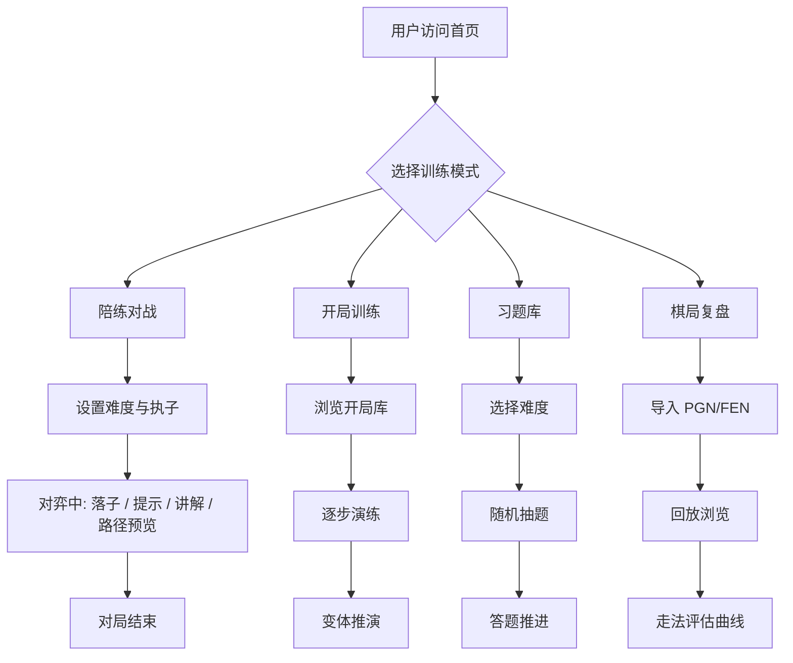

# 国际象棋训练陪练应用 · 产品需求文档（PRD）

## 1. 产品概述

一款部署于 GitHub Pages 的网页版国际象棋训练陪练应用，面向从初学者到中级选手的棋手。核心 AI 采用极小化极大（Minimax）算法配合 Alpha-Beta 剪枝实现递归最优解搜索，覆盖陪练对战、开局训练、习题演练与棋局复盘四大训练场景，致力于为用户提供一套可离线运行、零部署成本的完整训练闭环。

- **核心目标**：让用户在浏览器中即可完成「学—练—战—复盘」的国际象棋完整训练流程
- **目标用户**：国际象棋爱好者、学生、棋类培训机构学员（1200–2000 ELO 区间）
- **市场价值**：免下载、免登录、免服务器，开箱即用的轻量级训练工具

---

## 2. 核心功能

### 2.1 功能模块概览

1. **陪练对战**：核心训练场，AI 难度可调、走棋提示、棋理讲解、走法路径预览对比
2. **开局训练**：内置热门开局库，逐步走法练习与变体推演
3. **习题库**：一步杀至多步杀题库，难度分级、计时挑战
4. **棋局复盘**：PGN/FEN 解析、棋局回放、走法分析

### 2.2 页面详情

| 页面名称 | 模块名称 | 功能描述 |
|----------|----------|----------|
| 首页 | Hero 引导区 | 展示应用理念，四大训练模式快速入口 |
| 首页 | 训练模式卡片 | 四张模式卡片，悬停展示特色说明 |
| 首页 | 训练数据看板 | 本地保存的对战胜率、习题进度、训练时长 |
| 陪练对战 | 棋盘对弈区 | 8×8 棋盘、坐标标注、最近走棋高亮、合法走子提示 |
| 陪练对战 | AI 控制面板 | 难度滑块（1–10 级对应搜索深度 1–5）、AI 思考状态、悔棋、认输、重开 |
| 陪练对战 | 走棋提示器 | 「最佳走法」按钮、提示走法可视化、候选走法 Top 3 评估值对比 |
| 陪练对战 | 棋理讲解面板 | 当前局面下 AI 给出的人类可读解说（开局原则、战术主题、风险评估） |
| 陪练对战 | 走法路径预览 | 树状展开 AI 预测的 3–5 步主线路径，支持多分支对比 |
| 陪练对战 | 走棋历史侧栏 | 代数记谱法走子列表，点击任意步回跳 |
| 开局训练 | 开局库浏览 | 按名称/分类（开放性/半开放性/封闭性）筛选的开局卡片网格 |
| 开局训练 | 逐步演练 | 高亮当前应走的棋子与目标格，正确/错误反馈 |
| 开局训练 | 变体推演树 | 当前开局的 ECO 主线与常见变体分支树形图，可点击切换 |
| 开局训练 | 进度追踪 | 各开局掌握度（已练习次数/正确率），本地存储 |
| 习题库 | 难度分级 | 一步杀 / 两步杀 / 三步杀 / 多步杀，每级标注题目数量 |
| 习题库 | 习题展示 | FEN 加载局面，「轮到白方/黑方走，N 步杀」目标提示 |
| 习题库 | 交互答题 | 用户走子后 AI 应招，正确推进/错误重置反馈 |
| 习题库 | 计时与统计 | 单题计时、累计正确数、连胜计数 |
| 棋局复盘 | PGN/FEN 导入 | 文本框粘贴 PGN/FEN，校验并加载 |
| 棋局复盘 | 回放控制 | 上一步/下一步/自动播放/跳至首尾，播放速度调节 |
| 棋局复盘 | 走法分析 | 对每一步进行 AI 评估，标注「最佳/良好/疑问/失误/漏算」并用颜色条形图展示评估曲线 |
| 棋局复盘 | 导出功能 | 导出当前局面 FEN 或 PGN 至剪贴板 |

---

## 3. 核心流程

### 3.1 陪练对战流程

用户进入陪练页 → 选择难度与执子颜色 → 用户落子 → AI 思考（Minimax + Alpha-Beta） → 返回最佳走法与评估值 → 更新走棋历史 → 用户可随时请求提示/讲解/路径预览 → 直至将杀/和棋/认输。

### 3.2 开局训练流程

浏览开局库 → 选中开局 → 进入逐步演练 → 高亮提示走法 → 用户落子 → 系统校验并展示对方应对 → 推进至开局结束 → 用户可选择查看变体分支或重新练习。

### 3.3 习题演练流程

选择难度分级 → 系统随机抽题（FEN） → 用户解题 → AI 应招 → 完成则进入下一题，错误则提示重试 → 进度本地保存。

### 3.4 棋局复盘流程

粘贴 PGN/FEN → 系统解析为走子序列 → 用户使用回放控件逐步浏览 → 系统对每步做 AI 评估并绘制评估曲线 → 用户点击曲线节点跳转对应局面。

### 3.5 整体流程图

---

## 4. 用户界面设计

### 4.1 设计风格

- **核心美学**：编辑式奢华（Editorial Luxury）。深邃午夜蓝/炭黑作底，温润象牙白作文字，金箔色（#D4A574）作主点缀，深酒红（#8B2635）作警示与重要走法。营造「棋手书房」般的沉浸感。
- **主色与辅色**
  - 背景层：`#0E0F13`（午夜炭） / `#1A1C24`（深石板）
  - 文字主色：`#F2E9DC`（象牙白）
  - 强调色：`#D4A574`（古金）
  - 警示色：`#8B2635`（深酒红）/ `#5A8A5A`（苔绿，表示正确）
  - 棋盘浅格：`#E8D5B0`（奶油象牙）/ 深格：`#7D5A3C`（红木）
- **字体方案**
  - 显示字体：`Cormorant Garamond`（衬线，标题与品牌）
  - 正文字体：`Manrope`（无衬线，正文与 UI）
  - 数字/记谱：`JetBrains Mono`（等宽，走子记谱、评估值）
- **按钮风格**：扁平+极细金边描边，悬停时金色填充淡入；主操作按钮（如「请求提示」）实心金底深色字。
- **布局风格**：左侧固定侧栏导航 + 主内容区分栏布局；棋盘居中作视觉焦点，右侧为控制面板与讲解区。
- **图标风格**：线性金边图标（Lucide / 自绘 SVG），与衬线标题形成对比。

### 4.2 页面设计概览

| 页面名称 | 模块名称 | UI 元素 |
|----------|----------|---------|
| 首页 | Hero 引导区 | 全屏暗背景 + 金色细网格纹理 + 大号 Cormorant 标题 + 副标题 + 双 CTA 按钮（开始训练 / 浏览开局库） |
| 首页 | 训练模式卡片 | 4 列卡片，每卡含 SVG 国际象棋主题插画、模式名、一句话简介、悬停金色描边 |
| 首页 | 训练数据看板 | 3 列数据卡：胜率、习题进度、累计训练时长，金色数字 + Manrope 小字标签 |
| 陪练对战 | 棋盘对弈区 | 居中 8×8 棋盘，外有金色细边框 + 坐标 a–h/1–8 标注，最近走棋起止格高亮 |
| 陪练对战 | AI 控制面板 | 难度滑块（1–10，对应深度 1–5）、AI 思考进度条、悔棋/认输/重开按钮组 |
| 陪练对战 | 走棋提示器 | 「请求提示」金底按钮 + 提示走法箭头覆盖 + Top 3 候选走法评估值卡片 |
| 陪练对战 | 棋理讲解面板 | 卡片式讲解区，含战术主题标签 + 段落式解说 |
| 陪练对战 | 走法路径预览 | 树形结构图，节点为走子记谱，连线为评估值条 |
| 陪练对战 | 走棋历史侧栏 | 等宽字体双列（白/黑）走子表，可滚动，点击高亮跳转 |
| 开局训练 | 开局库浏览 | 卡片网格，每卡含开局名、ECO 代码、分类标签、掌握度进度条 |
| 开局训练 | 逐步演练 | 棋盘 + 提示气泡（高亮起始格与目标格）+ 进度指示器 |
| 开局训练 | 变体推演树 | 树形 SVG，节点为走子，分支可折叠 |
| 习题库 | 难度分级 | 4 个大卡片，金色数字 + 题量统计 + 进入按钮 |
| 习题库 | 习题展示 | 棋盘居中 + 目标提示横幅（「白方走，两步杀」）+ 计时器 |
| 习题库 | 交互答题 | 走子反馈动画（正确苔绿光、错误酒红震）+ 进度条 |
| 棋局复盘 | 导入区 | 大文本框 + 「解析」金色按钮 + 格式校验提示 |
| 棋局复盘 | 回放控制 | 横向控件栏：⏮ ◀ ▶/⏸ ▶⏭ + 速度选择（0.5×/1×/2×）+ 进度条 |
| 棋局复盘 | 走法分析 | 评估曲线 SVG 折线图（白方优势上、黑方优势下）+ 节点点击跳转 + 走子评级色块 |

### 4.3 响应式设计

- **桌面优先**：≥1280px 时呈现完整三栏布局（侧栏 + 棋盘 + 控制面板）
- **平板自适应**：768–1279px 折叠为单列，控制面板移至棋盘下方
- **移动端优化**：触控走子（点选起点→点选终点），按钮增大至 44px 触控目标，棋盘自适应屏幕宽度

### 4.4 关键交互细节

- **走子动画**：棋子移动采用 CSS transform 过渡（300ms ease-out），吃子时被吃方淡出
- **AI 思考反馈**：思考时显示金色脉冲呼吸圈，思考时长依据难度有 200ms–1.5s 模拟延迟以避免过快出招影响体验
- **微交互**：按钮悬停金色光晕、卡片悬停 4px 上浮 + 金边、走子记谱点击高亮
- **页面加载**：首屏金色细网格淡入 + 标题字距收紧动画（letter-spacing 收缩），营造仪式感
