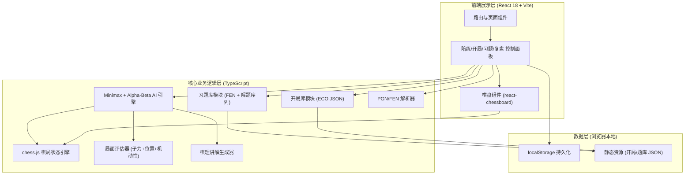
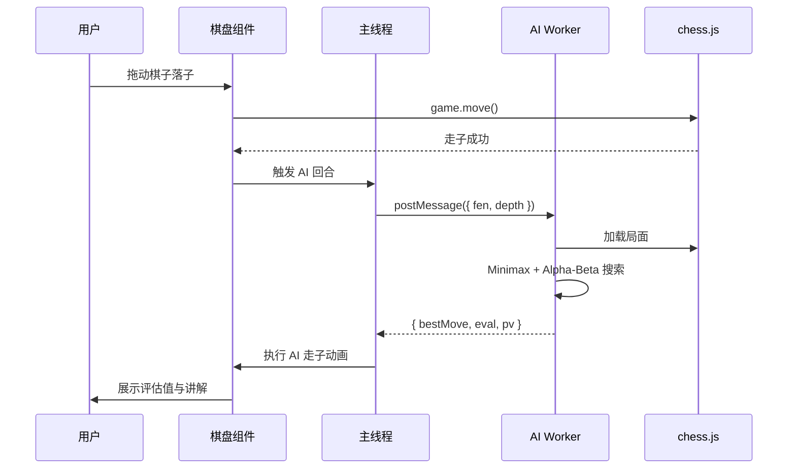
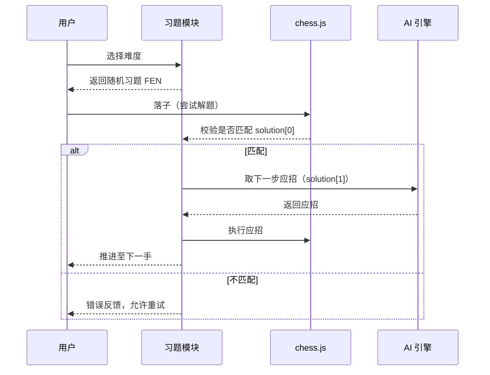

# 国际象棋训练陪练应用 · 技术架构文档

## 1. 架构设计



## 2. 技术栈说明

- **前端框架**：React@18 + TypeScript + Vite@5
- **样式方案**：TailwindCSS@3 + CSS 变量（主题色统一管理）+ 少量自定义 CSS（动画与棋盘绘制）
- **棋局引擎**：chess.js@1.0.0-beta（合法走子生成、终局判定、PGN/FEN 互转）
- **棋盘 UI**：react-chessboard@4（棋盘渲染与拖拽走子）
- **AI 算法**：自实现 Minimax + Alpha-Beta 剪枝（Web Worker 中运行避免阻塞 UI）
- **图标库**：lucide-react
- **图表（评估曲线）**：自绘 SVG（避免引入完整图表库，控制包体）
- **路由**：react-router-dom@6（HashRouter，兼容 GitHub Pages 静态托管）
- **部署目标**：GitHub Pages（静态构建，无后端服务）
- **持久化**：localStorage（训练进度、习题统计、对局记录）

## 3. 路由定义

| 路由 | 用途 |
|------|------|
| `/` | 首页：训练模式入口与数据看板 |
| `/play` | 陪练对战：AI 对弈 + 提示 + 讲解 + 路径预览 |
| `/openings` | 开局训练：开局库浏览 |
| `/openings/:eco` | 开局训练详情：逐步演练 + 变体推演 |
| `/puzzles` | 习题库：难度分级入口 |
| `/puzzles/:level` | 习题详情：习题答题界面 |
| `/review` | 棋局复盘：PGN/FEN 导入 + 回放 + 分析 |

## 4. AI 引擎核心设计

### 4.1 Minimax + Alpha-Beta 算法

```typescript
// 伪代码：核心搜索框架
function minimax(game: Chess, depth: number, alpha: number, beta: number,
                 maximizing: boolean): number {
  if (depth === 0 || game.isGameOver()) {
    return evaluatePosition(game);
  }

  const moves = orderMoves(game.moves()); // 走子排序优化剪枝
  if (maximizing) {
    let maxEval = -Infinity;
    for (const move of moves) {
      game.move(move);
      const eval = minimax(game, depth - 1, alpha, beta, false);
      game.undo();
      maxEval = Math.max(maxEval, eval);
      alpha = Math.max(alpha, eval);
      if (beta <= alpha) break; // β 剪枝
    }
    return maxEval;
  } else {
    let minEval = Infinity;
    for (const move of moves) {
      game.move(move);
      const eval = minimax(game, depth - 1, alpha, beta, true);
      game.undo();
      minEval = Math.min(minEval, eval);
      beta = Math.min(beta, eval);
      if (beta <= alpha) break; // α 剪枝
    }
    return minEval;
  }
}
```

### 4.2 难度映射

| 难度等级 | 搜索深度 | 启用剪枝 | 走子排序 | 适用人群 |
|----------|----------|----------|----------|----------|
| 1–2 | 1 | 否 | 否 | 初学 |
| 3–4 | 2 | 是 | 是 | 入门 |
| 5–6 | 3 | 是 | 是 | 中级 |
| 7–8 | 4 | 是 | 是 | 中高级 |
| 9–10 | 5 | 是 | 是 + 静态启发 | 高级 |

### 4.3 评估函数

```
评估值 = 子力分值 + 位置分值(兵形/王安全/控制中心) + 机动性分值
```

- 子力分值：兵=100，马=320，象=330，车=500，后=900，王=20000
- 位置分值：使用经典 piece-square table（PST），按棋子类型与颜色查表
- 王安全：王周围兵形 + 敌方威胁距离加权
- 评估值范围：±10000，超出表示接近将杀

### 4.4 Web Worker 隔离

AI 搜索运行于独立 Worker，主线程通过 `postMessage` 传递 FEN 与参数，Worker 返回 `{ bestMove, evaluation, principalVariation, candidateMoves }`，避免搜索期间 UI 卡顿。

## 5. 数据模型

### 5.1 开局库结构（openings.json）

```typescript
interface Opening {
  eco: string;          // ECO 代码，如 "C60"
  name: string;         // 开局名，如 "Ruy Lopez"
  nameZh: string;       // 中文名，如 "西班牙开局"
  category: 'open' | 'semi-open' | 'closed';
  mainLine: string[];   // 主线走子序列（SAN），如 ["e4","e5","Nf3","Nc6","Bb5"]
  variations: Variation[];
  description: string;
}

interface Variation {
  name: string;
  moves: string[];      // 该变体走子序列
  note: string;         // 变体说明
}
```

### 5.2 习题库结构（puzzles.json）

```typescript
interface Puzzle {
  id: string;
  level: 1 | 2 | 3 | 4; // 1=一步杀 2=两步杀 3=三步杀 4=多步杀
  fen: string;          // 初始局面 FEN
  solution: string[];   // 解题走子序列（含对方应招）
  theme: string[];      // 战术主题，如 ["pin", "fork"]
  rating: number;       // 习题难度 ELO
}
```

### 5.3 用户进度持久化（localStorage）

```typescript
interface UserProgress {
  // 陪练对战
  playStats: { wins: number; losses: number; draws: number; totalGames: number };
  // 开局训练
  openingProgress: Record<string, { practices: number; accuracy: number }>;
  // 习题库
  puzzleProgress: {
    solved: string[];          // 已解题 id
    streak: number;            // 当前连胜
    bestStreak: number;        // 最长连胜
    byLevel: Record<number, { total: number; solved: number }>;
  };
  // 复盘
  reviewHistory: { id: string; pgn: string; reviewedAt: number }[];
}
```

## 6. 关键流程时序

### 6.1 AI 走棋时序



### 6.2 习题解答时序



## 7. 性能与体积控制

- **构建产物目标**：单页 gzip < 250KB（不含开局/题库 JSON，JSON 按需懒加载）
- **AI 搜索性能**：深度 4 在中盘局面 < 800ms（Chrome M2 Mac 基准）
- **首屏加载**：路由级代码分割，首页仅加载首屏所需 chunk
- **静态资源**：开局库与题库 JSON 总大小控制 < 500KB，按路由懒加载
- **GitHub Pages 部署**：使用 `vite-plugin-gh-pages`，配置 `base` 为仓库名

## 8. 部署架构

```
GitHub 仓库 (main 分支)
   ↓ GitHub Actions 触发
   ↓ npm run build
   ↓ vite-plugin-gh-pages 推送 dist/ 至 gh-pages 分支
GitHub Pages 静态托管 (https://<user>.github.io/<repo>/)
   ↓ 用户浏览器加载
   ↓ HashRouter 路由（无需服务端 fallback）
   ↓ localStorage 本地持久化
```

## 9. 项目目录结构

```
chess/
├── public/
│   ├── openings.json          # 开局库
│   └── puzzles.json           # 习题库
├── src/
│   ├── main.tsx
│   ├── App.tsx
│   ├── routes/                # 路由页面
│   │   ├── Home.tsx
│   │   ├── Play.tsx
│   │   ├── Openings.tsx
│   │   ├── OpeningDetail.tsx
│   │   ├── Puzzles.tsx
│   │   ├── PuzzleDetail.tsx
│   │   └── Review.tsx
│   ├── components/
│   │   ├── layout/            # 侧栏、Header
│   │   ├── board/             # 棋盘与走子组件
│   │   ├── play/              # 陪练控制相关
│   │   ├── openings/          # 开局训练相关
│   │   ├── puzzles/           # 习题相关
│   │   └── review/            # 复盘相关
│   ├── engine/
│   │   ├── ai.worker.ts       # AI 搜索 Worker
│   │   ├── minimax.ts         # Minimax + Alpha-Beta
│   │   ├── evaluation.ts      # 评估函数
│   │   ├── moveOrdering.ts    # 走子排序
│   │   └── explainer.ts       # 棋理讲解生成
│   ├── lib/
│   │   ├── chess.ts           # chess.js 封装
│   │   ├── pgnParser.ts       # PGN 解析
│   │   └── storage.ts         # localStorage 封装
│   ├── data/
│   │   ├── openings.ts        # 开局库加载
│   │   └── puzzles.ts         # 习题库加载
│   ├── hooks/
│   ├── store/                 # 状态管理（Zustand）
│   ├── styles/
│   │   └── globals.css
│   └── types/
├── .github/workflows/deploy.yml
├── vite.config.ts
├── tailwind.config.ts
├── tsconfig.json
└── package.json
```
